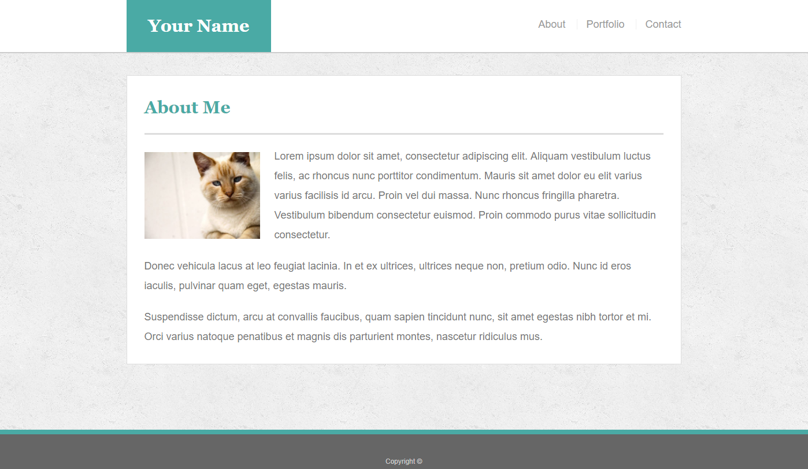

- The content in `index.html` should be unique to you in the following ways:

  - The main logo where it says "Your Name" should say your name. This may make the logo section smaller or wider depending on how long your name is—that is fine and expected.

  - Teal color used for backgrounds): `#4aaaa5`

- Dimensions:

  - The entire content and the main section content area is `960px` wide.

  

- Make a "sticky footer." You will notice that the dark gray footer will always rest just below the content. This is fine whenever your site has enough content to push it down past the height of most monitors. But if there isn't much content in the body, the footer could rest in the middle of the page:

  - Try to code the footer in a way that it will always remain at the bottom of the page, no matter how short the content is. Refer to this [sticky footer tutorial](https://css-tricks.com/couple-takes-sticky-footer/) for guidance.
  - Give the footer the following CSS: `border-top: 8px solid #4aaaa5;`

`padding`, `margin`, `overflow`, `clear`
